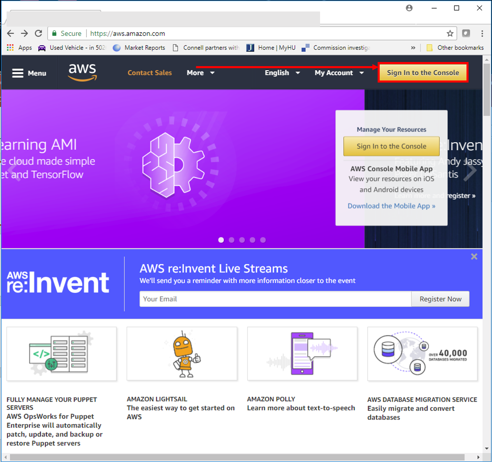
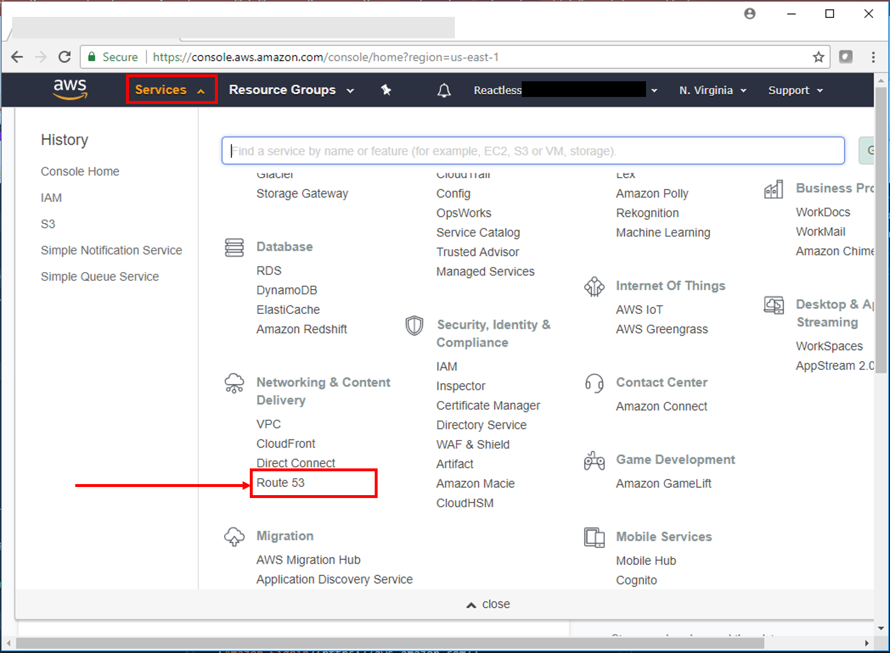
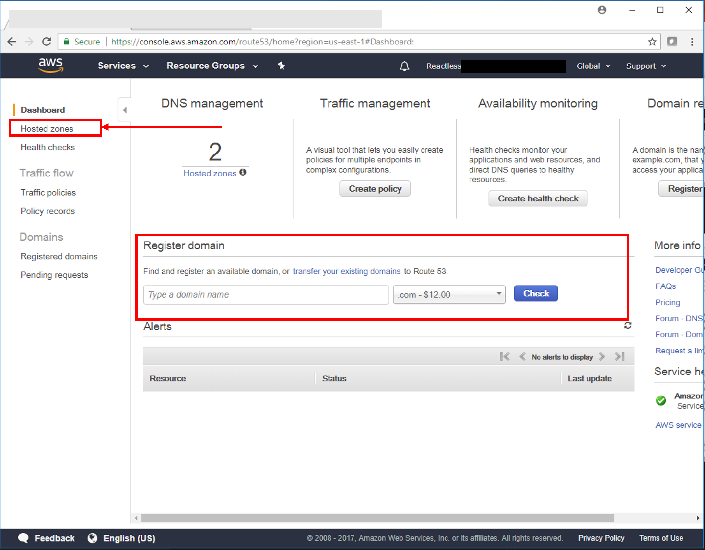
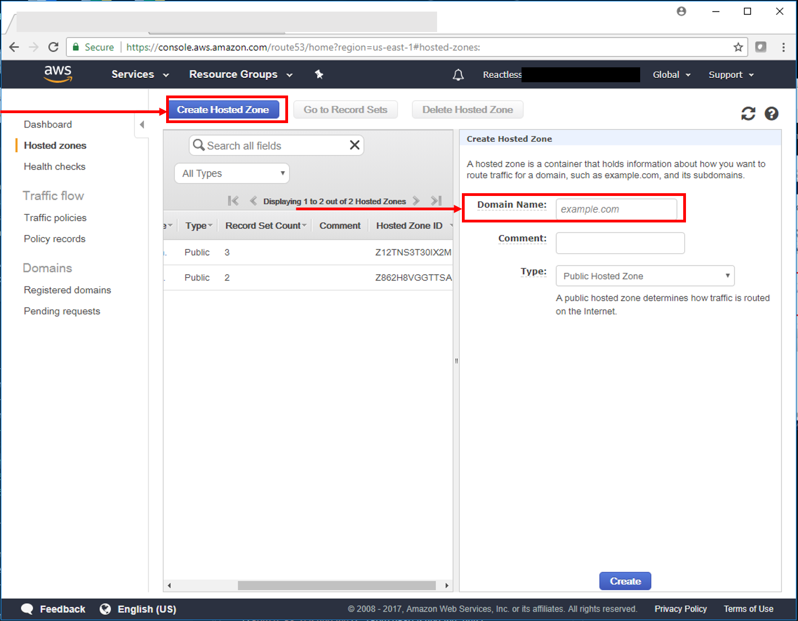
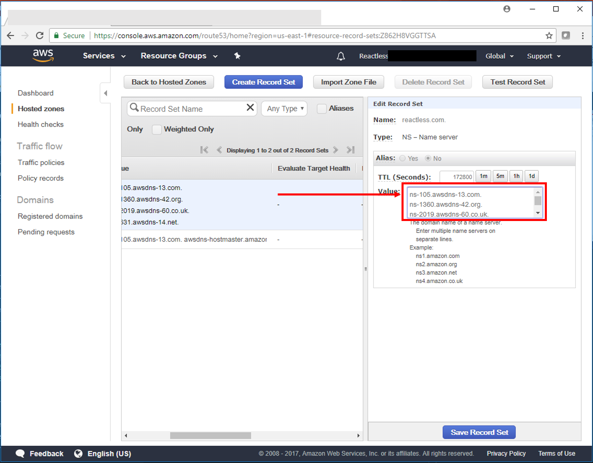

# Setup Gatsby on Amazon Web Services

I'm a huge fan of Amazon Web Services.  Not only the leader in cloud computing, Amazon AWS provides tremendous value.  AWS is a perfect match for Gatsby because you can't have a blazing fast website if you don't have a blazing fast network.  Amazon provides the ability to push your Gatsby out on the Amazon CDN globally so your site will be blazing fast world wide.

So let's get started.

## Signup for Amazon Web Services Account

I'm assuming that you already have an Amazon AWS account.  If you don't already have an account go to the AWS link and create a new account for yourself.  We'll be using services on the free tier or mostly free tier so it will cost nothing to very little to host your website with Amazon.  

[Amazon Signin - https://aws.amazon.com/](https://aws.amazon.com/)

## Route 53 - Manage your domain

If you're not familiar with AWS don't worry.  It can be overwhelming at first because AWS has so many different cloud services and the list keeps growing.  You don't need to worry after a little time you'll start getting comfortable with all the AWS has to offer.

To start with select the services menu at the top and look for Networking & Content Delivery and you'll find the Route 53 link.  

Click on Route 53.

This brings you to the Route 53 Dashboard where you have 2 choices.  If you don't already have a domain you can Register a new domain here.  You'll see that functionality in the middle of the page.  Since we already have a domain name registered with a different domain registrar we'll create a Hosted zone in Route 53 and let Route 53 manage our name servers.

To start we'll click the Hosted zone link on the top left sidebar on the page. 

From the Hosted Zones page start by click in the Create Hosted Zone Button.

Now you'll have the ability to add your domain name in the text input on the right side of the page.  

NOTE: Domain name is example.com NOT www.example.com

Once you've input the domain name click the Create button at the bottom of the page.

Once you've created your hosted zone you'll want to copy the DNS Servers so you can add those to your domain registrar.  Clicking on your domain name on the Hosted Zones page should bring up the DNS Server names on the right that you can copy.  In my case there were 4 DNS server names to copy.  

You'll have to check with you domain register to determine how to add these DNS Server names.

Once you've changed the DNS Server names at your domain registrar it make take a few hours to a few days before the changes are made across the network and you can use your domain name at Amazon. 

I hope you've enjoyed this post.  You can view [part 2](posts/gatsby-on-aws-part-2) of this series on how to setup S3 bucket to serve your static web site.  
